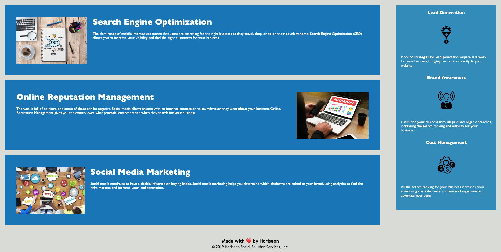

## Name
Challenge 01 for the HTML, CSS and Git module of the Coding Bootcamp

## Description
Simple website layout for Horiseon company, which features Semantic HTML elements

## Visuals

## Usage
Open the Developer Console in your browser (FN + F12) and view the various elements, this includes for example header, nav and section. You can also test the Navigation links at the top of the webpage, which will direct you to the corresponding image/information for each of them.

## License
Using standard MIT license